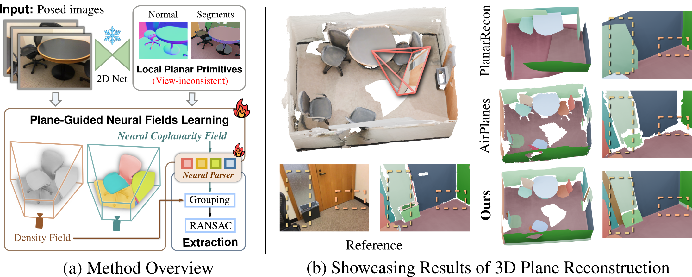
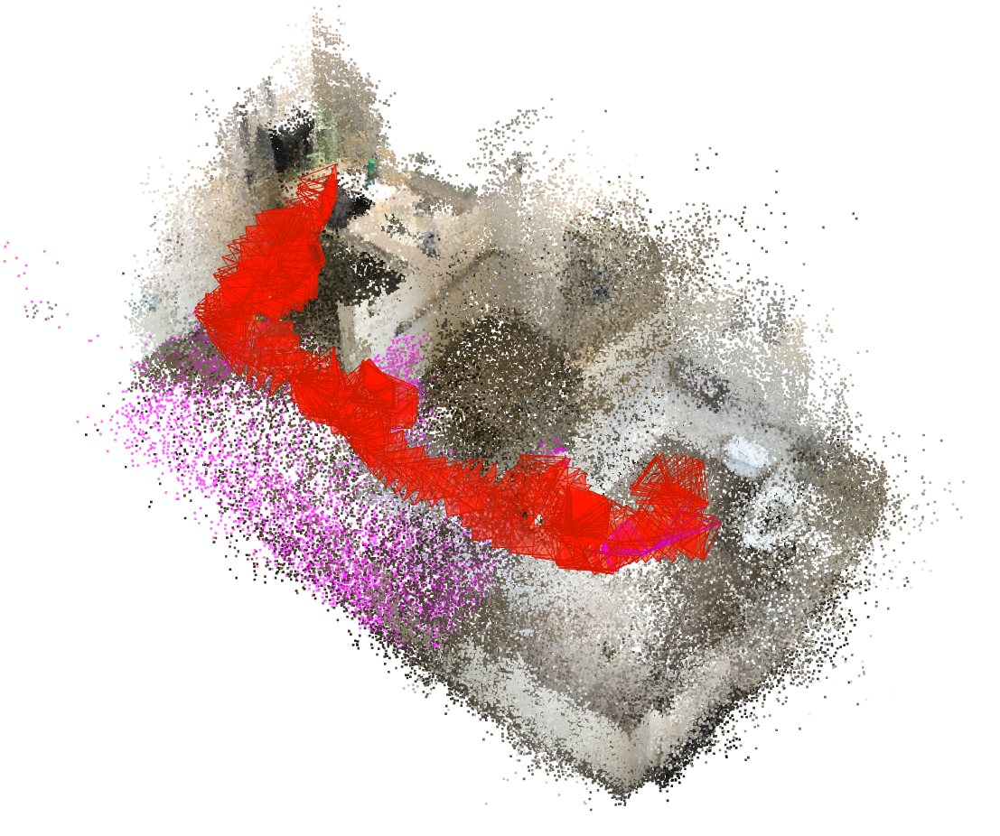
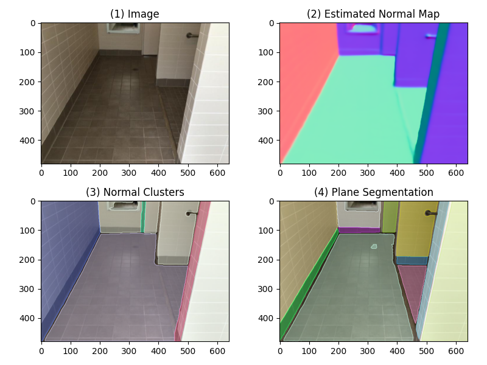
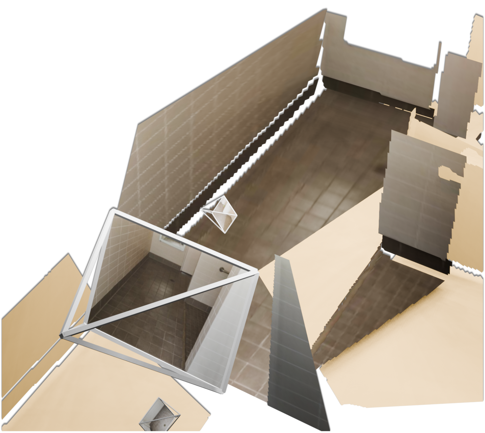

# ✈️ Structured 3D Reconstruction in Planar Primitives with Neural Fields
### [Project Page](https://neuralplane.github.io/) | [Paper](https://openreview.net/pdf?id=5UKrnKuspb)

> NeuralPlane: Structured 3D Reconstruction in Planar Primitives with Neural Fields \
> [Hanqiao Ye](https://timber-ye.github.io/), [Yuzhou Liu](https://paulliuyz.github.io/), [Yangdong Liu](http://3dv.ac.cn/en/faculty/ydl/), [Shuhan Shen](http://3dv.ac.cn/en/faculty/shs/) \
> ICLR 2025

## 📋 Abstract
<details>
  <summary><b>TL; DR</b>  NeuralPlane rebuilds indoor scenes as arrangements of planar primitives from multi-view images. </summary>

  3D maps assembled from planar primitives are compact and expressive in representing man-made environments. In this paper, we present NeuralPlane, a novel approach that explores neural fields for multi-view 3D plane reconstruction. Our method is centered upon the core idea of distilling geometric and semantic cues from inconsistent 2D plane observations into a unified 3D neural representation, which unlocks the full leverage of plane attributes. It is accomplished through several key designs, including: 1) a monocular module that generates geometrically smooth and semantically meaningful segments known as 2D plane observations, 2) a plane-guided training procedure that implicitly learns accurate 3D geometry from the multi-view plane observations, and 3) a self-supervised feature field termed Neural Coplanarity Field that enables the modeling of scene semantics alongside the geometry. Without relying on prior plane annotations, our method achieves high-fidelity reconstruction comprising planar primitives that are not only crisp but also well-aligned with the semantic content. Comprehensive experiments on ScanNetv2 and ScanNet++ demonstrate the superiority of our method in both geometry and semantics.
</details>
<br>
<div align=center></div>

## 💥 News

- [2025/04] Code is released.
- [2025/02] [Paper](https://openreview.net/pdf?id=5UKrnKuspb) is to be presented as an oral in **ICLR 2025**.

## 🕹️ Getting Started

### 1. Environment Setup

```bash
git clone https://github.com/3dv-casia/NeuralPlane
```

We recommend using conda to manage dependencies, which have been tested on NVIDIA RTX 3090/A5000/A6000 with CUDA 11.8 and Python 3.10:

[Step-by-step Installation](./doc/env_setup.md)

### 2. Data Preparation for ScanNetv2

Download and extract ScanNet by following the instructions provided at https://github.com/ScanNet/ScanNet.

<details>
  <summary>[Expected directory structure of ScanNet (click to expand)]</summary>

The label mapping file `scannetv2-labels.combined.tsv` is needed when generating gt planes. It is downloaded with the official scirpt.

```
DATAROOT
└── scannetv2
    ├── scannetv2-labels.combined.tsv
    ├── scans
    │   ├── ...
    │   ├── scene0084_00
    │   │   ├── scene0084_00.aggregation.json
    │   │   ├── scene0084_00.sens  # RGB-D stream
    │   │   ├── scene0084_00.txt
    │   │   ├── scene0084_00_vh_clean_2.0.010000.segs.json
    │   │   ├── scene0084_00_vh_clean_2.labels.ply
    │   │   └── scene0084_00_vh_clean_2.ply
    │   └── ...
    └── scans_test
```
</details>
</br>

Next run the data preparation script which parses the raw data into the required format (640x480, lower frame rate).
This script also generates the ground truth Planes. The plane generation code is modified from [PlaneRCNN](https://github.com/NVlabs/planercnn/blob/master/data_prep/parse.py) and [PlanarRecon](https://github.com/neu-vi/PlanarRecon).

```bash
python data/setup_scannetv2.py --src-dir ${DATAROOT} --dst_dir "./datasets" --out_dir "./outputs" --id 0084_00
```

Run `python data/setup_scannetv2.py --help` for more instructions on options.

<details>
  <summary>[Expected directory structure of input data (click to expand)]</summary>

```
datasets
└── scannetv2
    ├── 0084_00
    │   ├── annotations
    │   │   ├── eval
    │   │   │   ├── gt_labels.txt  # for seg eval
    │   │   │   └── gt_verts.ply  # for geo eval
    │   │   ├── planes_mesh_vis.ply  # reference model (gt)
    │   ├── color  # resized and downsampled rgb images
    │   ├── depth
    │   ├── intrinsic
    │   └── pose
    └── ...
```
</details>

### 3. Preprocessing

#### a. Triangulating Sparse 3D Keypoints

Initializing local plane geometry relies on sparse 3D keypoints by triangulating a new SfM model from given poses. Please refer to [hLoc](https://github.com/cvg/Hierarchical-Localization).

```sh
np-pre-geo-init --config ${PATH_TO_CONFIG}
# e.g. "./configs/${TIMESTAMP}/0084_00.yaml"
# or
# python neuralplane/scripts/sparse_keypoints.py --config ${PATH_TO_CONFIG}
```
Run `np-pre-geo-init --help` for more instructions on options.

#### b. Excavating Local Planar Primitives

> **Note**: we use OpenGL coodinate system following Nerfstudio. A plane is parameterized as a 4-dim vector $[\vec{n}, d]: \vec{n}\cdot p + d = 0$

```bash
np-pre-seg --config ${PATH_TO_CONFIG}
# or
# python neuralplane/scripts/local_planar_primitives.py --config ${PATH_TO_CONFIG}
```
Run `np-pre-seg --help` for more instructions on options.

<table style="width: 100%;">
  <tr>
    <td style="text-align: center;">
      
      <br /><em>(1) SfM keypoints</em>
    </td>
    <td style="text-align: center;">
      
      <br /><em>(2) Plane Segments</em>
    </td>
    <td style="text-align: center;">
      
      <br /><em>(3) Local Planar Primitives</em>
    </td>
  </tr>
</table>

### 4. Training

```bash
np-train --config ${PATH_TO_CONFIG}
# or
# python neuralplane/scripts/np_train.py --config ${PATH_TO_CONFIG}
```
Run `np-train --help` for more instructions on options.

### 5. Exporting Results

```bash
np-export --config ${PATH_TO_CONFIG}
# or
# python neuralplane/scripts/export.py --config ${PATH_TO_CONFIG}
```

### 6. Evaluation

```bash
np-eval --config ${PATH_TO_CONFIG}
# or
# python neuralplane/scripts/np_eval.py --config ${PATH_TO_CONFIG}
```

### [Alternative] Steps 3-6 in a Single Command
After data preparation, you can use our script to reconstruction a plane map with a single command:
```bash
bash scripts/launch_single.sh -i ${SCENE_ID} -t ${TIMESTAMP} -g ${GPU_ID}
```


## ❤️ Acknowledgements
Our implementation is based on the excellent open source projects (sorted in alphabetical order):
- [GARField](https://github.com/chungmin99/garfield)
- [hLoc](https://github.com/cvg/Hierarchical-Localization)
- [Nerfstudio](https://github.com/nerfstudio-project/nerfstudio)
- [PlanarRecon](https://github.com/neu-vi/planarrecon)
- [SAM](https://github.com/facebookresearch/segment-anything)
- [SNU (Surface Normal Uncertainty)](https://github.com/baegwangbin/surface_normal_uncertainty)
- [SuperPrimitive](https://github.com/makezur/super_primitive)

## ⭐ Citation

If you find our paper and code useful for your research, please consider citing us and giving a star to our repository:

```bib
@inproceedings{ye2025neuralplane,
  title={NeuralPlane: Structured 3D Reconstruction in Planar Primitives with Neural Fields},
  author={Hanqiao Ye and Yuzhou Liu and Yangdong Liu and Shuhan Shen},
  booktitle={The Thirteenth International Conference on Learning Representations},
  shorttitle={neuralplane},
  year={2025},
  url={https://openreview.net/forum?id=5UKrnKuspb}
}
```